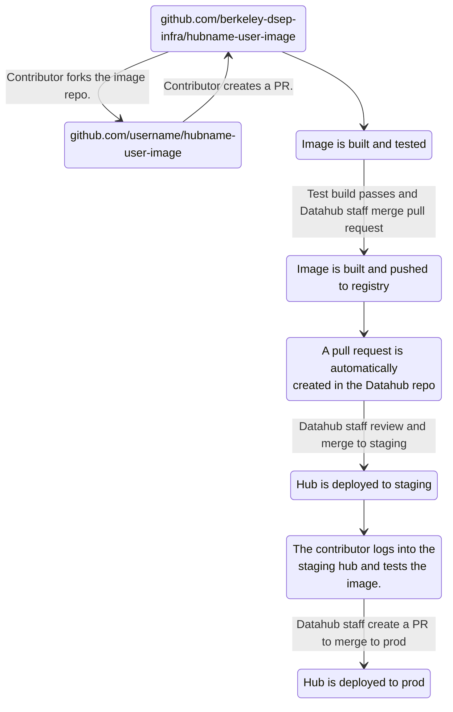

## Prerequisites and Setup

1. Ensure you have [Git installed](https://git-scm.com/book/en/v2/Getting-Started-Installing-Git) on your local device.
2. Install [repo2docker](https://repo2docker.readthedocs.io/en/latest/install.html) for building and testing Docker images locally.
3. Set up an SSH key in your [GitHub profile settings](https://github.com/settings/keys).

## Fork, Clone, and Maintain Your Repository

First, go to the GitHub repository of the image you'd like to work on and create a fork. To do this, click on the `Fork` button and then `Create fork`.


After creating your fork, disable GitHub Actions **only for your fork**. Navigate to `Settings` > `Actions` > `General` and select `Disable actions`. Then click `Save`:


Now clone the primary image repository to your local device. You can get the URL by clicking on the green `Code` button in the primary image repository (*not* your fork), selecting `SSH`, and copying the URL:


Navigate to a convenient folder on your device and clone the primary repository by running the following command (replace `<image-name>` with the actual name of the image):

```bash
git clone git@github.com:berkeley-dsep-infra/<image-name>.git
```

Navigate into the `<image-name>` directory and set up your local repository to point to both the primary image repository (`upstream`) and your fork (`origin`). After the initial clone, `origin` will point to the main repository, so you'll need to change it:

```bash
cd <image-name>
git remote rename origin upstream # Rename origin to upstream
git remote add origin git@github.com:<your-github-username>/<image-name>.git # Add your fork as origin
```

To confirm these changes, run `git remote -v`:

```shell-session
$ git remote -v
origin	git@github.com:<your-github-username>/<image-name>.git (fetch)
origin	git@github.com:<your-github-username>/<image-name>.git (push)
upstream	git@github.com:berkeley-dsep-infra/<image-name>.git (fetch)
upstream	git@github.com:berkeley-dsep-infra/<image-name>.git (push)
```

### Keep Your Fork Up to Date

When developing for this deployment, always work in a fork of this repository. Ensure your repository is up-to-date with the primary repository before making changes. This prevents conflicts caused by other contributors' changes.

```bash
git checkout main && \
git fetch --prune --all && \
git rebase upstream/main && \
git push origin main
```

To create a new feature branch and switch to it, run:

```bash
git checkout -b <branch-name>
```

See what has been modified after making changes:

```bash
git status
git diff
```

## Developing and Testing Your Docker Image

### Workflow Overview



These steps will be explained in detail below.

### Build and Test the Image Locally

Use [repo2docker](https://repo2docker.readthedocs.io/en/latest/) to build and test the image on your local device before pushing and creating a pull request. This is faster and avoids wasting GitHub Action minutes.

Run `repo2docker` from inside the cloned image repository. On Linux/WSL2 or a regular Linux shell:

```bash
repo2docker . # Path to the repo
```

If you are using an ARM CPU, such as an Apple Silicon processor, run `jupyter-repo2docker` with these arguments:

```bash
jupyter-repo2docker --user-id=1000 --user-name=jovyan \
  --Repo2Docker.platform=linux/amd64 \
  --target-repo-dir=/home/jovyan/.cache \
  -e PLAYWRIGHT_BROWSERS_PATH=/srv/conda \
  . # Path to the repo
```

To build the image without automatically launching the server, add `--no-run` before the final `.`.

### Commit and Push Your Changes

When ready to push changes, stage them for a commit:

```bash
git add <file1> <file2> ...
```

Commit the changes locally:

```bash
git commit -m "Descriptive commit message."
```

Push to your fork:

```bash
git push origin <branch-name>
```

### Open a Pull Request

Once you've pushed to your fork, go to the image repository. There should be a green button labeled `Compare and pull request`. Click it, review the commits and file diffs, edit the title and description if needed, and click `Create pull request`.


Refer to the [GitHub documentation for pull requests](https://help.github.com/articles/about-pull-requests/) if needed. Keep the `base` as the primary repository and `head` as your fork.

Once complete, a GitHub action will automatically [build and test](https://github.com/berkeley-dsep-infra/hub-user-image-template/blob/main/.github/workflows/build-test-image.yaml) the image. If it fails, check the workflow output and make necessary changes.

## Review, Merge, and Deployment

After a successful image build, request a review or merge the PR if confident. Merging triggers a [second GitHub workflow](https://github.com/berkeley-dsep-infra/hub-user-image-template/blob/main/.github/workflows/build-push-create-pr.yaml) that builds the image again, pushes it to Google Artifact Registry, and creates a pull request in the [Datahub](https://github.com/berkeley-dsep-infra/datahub) repository to update the image hash.

Notify Datahub staff about the pull request. They will review and merge it into the `staging` branch. Notify them via a GitHub Issue or the UCTech #datahubs Slack channel.

Once merged to `staging`, the new image will deploy to the hub's staging environment within minutes for testing.

When satisfied with the results, inform Datahub staff. They will create another pull request to deploy the new image to `prod`.

## Troubleshooting

- **SSH Key Issues:** If you have trouble cloning or pushing, ensure your SSH key is added to your GitHub account and your SSH agent is running.
- **Permission Errors:** Double-check repository access and remote URLs.
- **Build Failures:** Review the error logs from repo2docker or GitHub Actions for details. Common issues include missing dependencies or syntax errors in Docker-related files.
- **Sync Conflicts:** If you encounter merge conflicts when rebasing, resolve them locally and continue the rebase process.

For more help, see the [GitHub Docs](https://docs.github.com/en), [repo2docker documentation](https://repo2docker.readthedocs.io/en/latest/), or ask in the UCTech #datahubs Slack channel.
